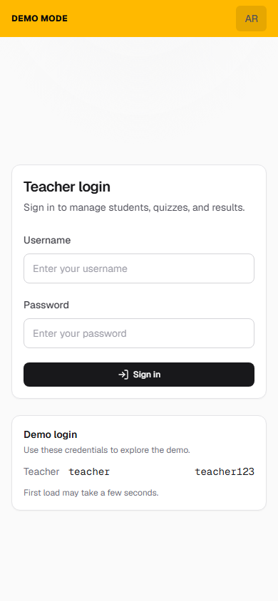
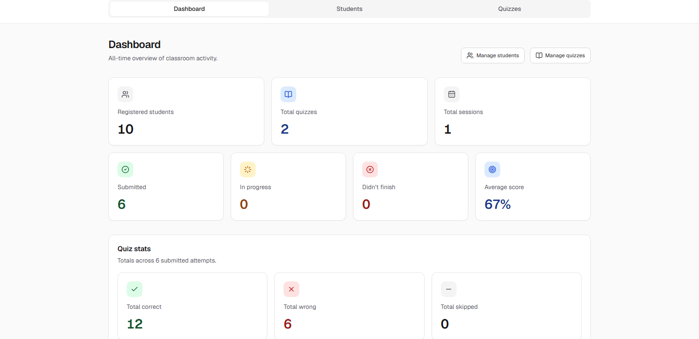
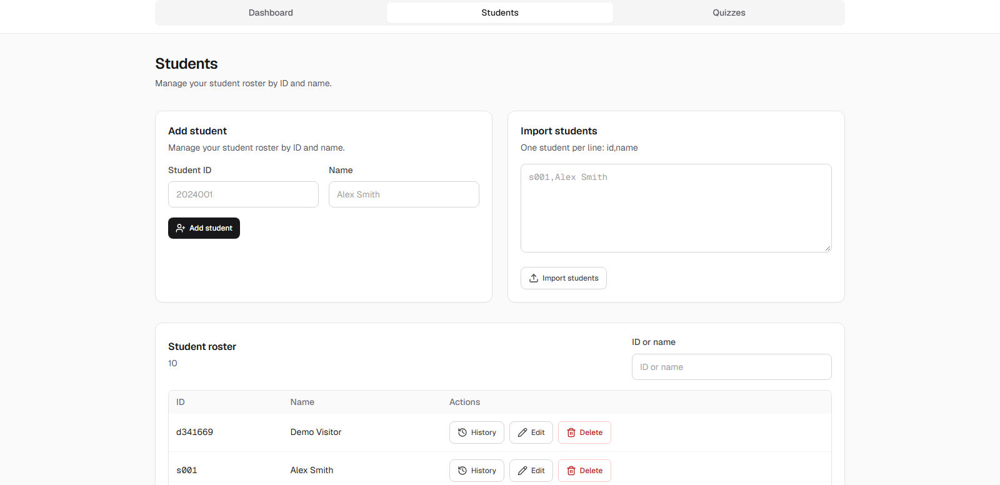
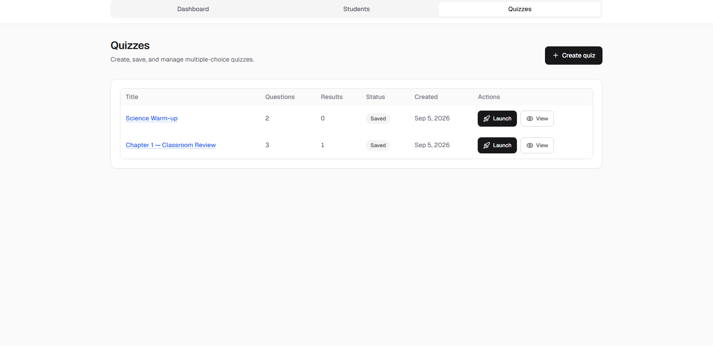
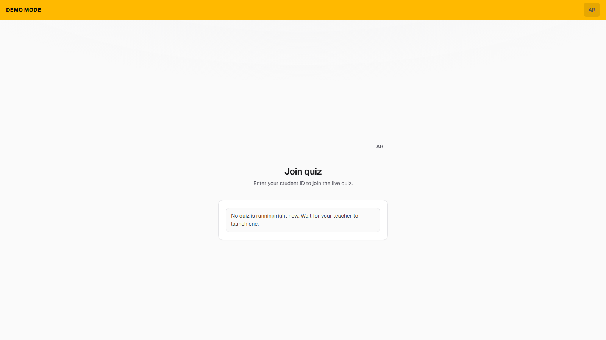
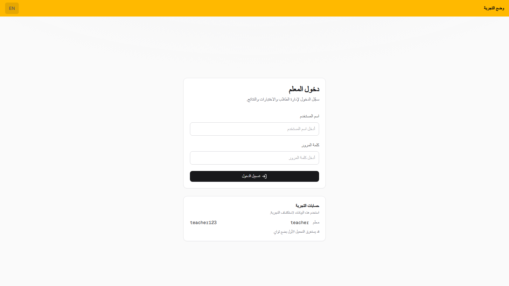

# 📝 Quiz Platform — Live Classroom Quizzes

A bilingual classroom quiz platform built so a teacher can launch multiple-choice quizzes from one device while students join from their phones on the same network — or from the public demo — using a student ID. The console covers roster management, quiz authoring, live sessions, auto-grading, and an all-time results dashboard.

The app gives teachers a single place to run a class quiz end to end: import students, build questions by hand or paste, launch a live session, watch join counts, then review scores, participation, and question-level stats in English or Arabic.

---

## 🔧 Features

### 👩‍🏫 Teacher Console

- Dashboard with all-time stats, charts, and top attempts / session results
- Student roster: add, edit, delete, search, and bulk import by ID
- Per-student quiz history with scores and session links
- Create, edit, and delete MCQ quizzes (manual builder or paste import)

### 📡 Live Sessions

- Launch one live quiz at a time and share a join link
- Students join at `/join` with a registered ID — no student login
- Questions and options shuffled per attempt, then auto-graded on submit
- Live joined counts, session results, and close-session controls

### 📊 Results & Analytics

- Session results: participation, submitted vs in progress, score range
- Question stats: most missed, easiest, and correct-rate per item
- Charts for answer breakdown, participation mix, and score trend
- Recent sessions table with jump links into each run

### 🌍 Multilingual Experience

- Full English and Arabic UI via `next-intl`
- RTL / LTR layout with a language toggle on login and the teacher shell
- Localized validation, API errors, and status labels

---

## 💡 Impact

- Turned a LAN classroom quiz flow into a public, bilingual demo teachers can explore without setup
- Centralized roster, authoring, live launch, and results in one Next.js console
- Gave students a phone-friendly join path that only needs a student ID
- Made session outcomes visible immediately: scores, participation, and question difficulty

---

## 📦 Tech Stack

| Layer      | Tech                                      |
| ---------- | ----------------------------------------- |
| Framework  | Next.js 16, React 19, TypeScript          |
| i18n       | next-intl (English / Arabic)              |
| Database   | PostgreSQL 18, Drizzle ORM                |
| Auth       | iron-session, bcryptjs                    |
| Charts     | Recharts                                  |
| Styling    | Tailwind CSS 4                            |
| Deployment | Neon + Vercel                             |

---

## 🌐 Deployment Notes

- Fully responsive teacher console and student join / quiz-taking flow
- Demo database on Neon with a wipe-and-reseed script (`npm run seed:demo`)
- Public demo hosted on Vercel; first load may take a few seconds to wake
- Designed for classroom LAN use as well as a hosted demo URL

---

## 🎬 Site Demo

**[▶ Watch site walkthrough](./docs/quiz-platform-demo.mp4)** (~1 min)

Login → dashboard → students → quizzes → student join → Arabic.

---

## 📸 Screenshots

- Teacher Login
  

- Mobile Preview
  

- Dashboard
  

- Students
  

- Quizzes
  

- Student Join
  

- Arabic Login
  

## Live Demo 🚀

[**View Live Demo**](https://quiz-platform-demo-nine.vercel.app)

| Role    | Username | Password   |
| ------- | -------- | ---------- |
| Teacher | teacher  | teacher123 |

Students open `/join` and use a seeded ID such as `s001`.

---

## Author

👤 **Omar Mahmoud**
📧 [omrmhd54@gmail.com](mailto:omrmhd54@gmail.com)
💼 [LinkedIn](https://www.linkedin.com/in/omrmhd5/)
🌐 [Portfolio](https://omarmahmoud.dev/)
🔗 [GitHub](https://github.com/omrmhd5)
